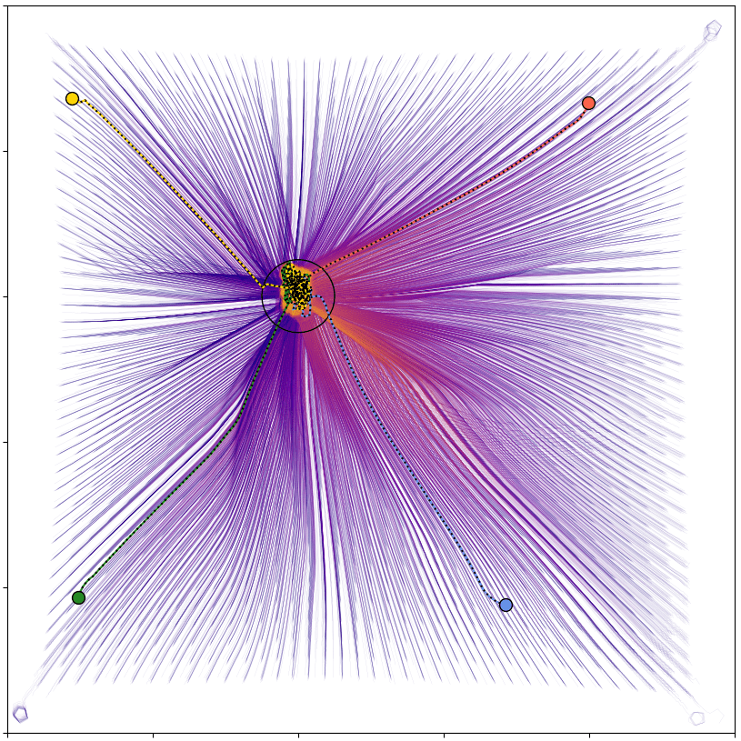

# Visuospatial navigation without distance, prediction, or maps

**Author of Model:** Patrick Govoni  
**Supervisors:** Prof. Pawel Romanczuk  
**Affiliation:** Institute for Theoretical Biology, Department of Biology, Humboldt Universität zu Berlin  
**Group:** [Collective Information Processing Lab](http://lab.romanczuk.de/)  
**Timespan:** 2023-Present

**Abstract:**  
Navigation is controlled by at least two partially dissociable, concurrently developed systems in the brain. 
The cognitive map informs an organism of its location, bearing, and distances between environmental features, enabling shortcuts. 
Response-based navigation, on the other hand, the process of composing percept-action pairs into routes, 
is regarded as inaccurate and inflexible, ultimately subserving map-based representation. 
As such, navigation models tend to assume the primacy of maps, 
top-down constructed via predictive control and distance perception, while neglecting response-based strategies. 
Here we show the sufficiency of a minimal feedforward framework in a classic visual navigation task. 
Our agents, directly translating visual perception to movement, navigate to a hidden goal in an open field, 
an environment often assumed to require map-based representation. 
While visual distance enables direct trajectories to the goal, 
two distinct algorithms develop to robustly navigate using visual angles alone. 
Each of the three confers unique contextual tradeoffs as well as aligns with behavior observed with rodents, 
insects, fish, and sperm cells, suggesting the widespread significance of response-based strategies. 
We advocate further study of navigation from the bottom-up without assuming online access to computationally expensive top-down representations, 
which may better explain behavior under energetic or attentional constraints.

  
  
  

  
  
  

**Manuscript:**  
[Preprint](https://arxiv.org/abs/2407.13535v2)  

**Citation:**  
Govoni, P., Romanczuk, P. Visuospatial navigation without distance, prediction, or maps. (2024). 

**License:**  
Copyright © 2023 [Patrick Govoni](https://github.com/pgovoni21).  
This project is [MIT](https://github.com/pgovoni21/vis-nav-abm?tab=MIT-1-ov-file) licensed.
